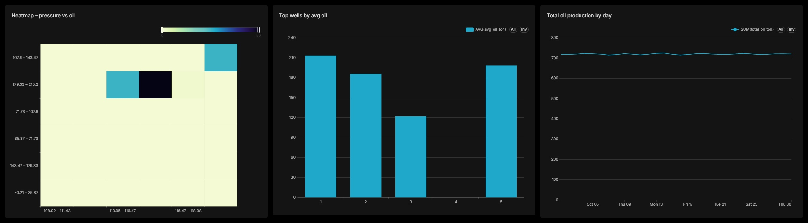

# Oil Analytics Pipeline

Полный аналитический pipeline для данных нефтедобычи: **PostgreSQL → ETL/ELT → MinIO → обработка → Jupyter → витрины → Superset**.

---

## Архитектура решения

```text
SQL scripts
   ↓
PostgreSQL
   ↓
ETL / ELT (Python, pandas)
   ↓
MinIO (raw / staging / curated)
   ↓
Jupyter notebooks / feature engineering / ML
   ↓
Analytical marts in PostgreSQL
   ↓
Apache Superset dashboards
```

---

## Структура репозитория

```text
oil-analytics-pipeline/
├── README.md
├── .env
├── docker-compose.yml
│
├── sql/
│   ├── 00_create_schema.sql
│   ├── 01_load_wells_production.sql
│   ├── 02_load_well_targets_telemetry.sql
│   ├── 03_load_pumps_failures.sql
│   └── 04_load_deliveries.sql
│   ├── 05_extend_telemetry.sql
│   └── 06_extend_pump_sensors.sql
│
├── init/
│   └── minio/
│       └── create-buckets.sh
│
├── etl/
│   ├── extract_to_minio.py
│   ├── transform_curated.py
│   ├── config.py
│   └── requirements.txt
│
├── notebooks/
│   ├── 01_data_check.ipynb
│   ├── 02_production_analytics.ipynb
│   ├── 03_ml_rate_forecast.ipynb
│   ├── 04_pump_anomaly_detection.ipynb
│   └── 05_logistics_analysis.ipynb
│
├── models/
│   └── metrics.json
│
├── superset/
│   └── Dockerfile
│
├── jupyter/
│   └── Dockerfile
│
└── docs/
    └── boards/
```

---

## Данные проекта

В проекте используются предоставленные SQL-скрипты.

### 1. Добыча и скважины

Основные таблицы:

- `wells` — справочник скважин;
- `production` — суточная добыча и производственные показатели.

Поля `production` включают:

- нефть;
- газ;
- воду;
- энергопотребление;
- часы простоя;
- температуру;
- давление.

### 2. Телеметрия и целевые значения

Основные таблицы:

- `well_telemetry` — почасовая телеметрия оборудования;
- `well_targets` — целевой или фактический суточный дебит для ML-задачи.

Используются признаки:

- давление;
- температура;
- ток насоса;
- обороты;
- вибрация;
- расход нефти.

### 3. Насосы и отказы

Основные таблицы:

- `pumps`;
- `pump_sensors`;
- `pump_failures`.

Используются признаки:

- вибрация;
- температура;
- ток;
- обороты;
- факты отказов.

### 4. Логистика

Основная таблица:

- `deliveries`.

Поля включают:

- маршрут;
- объём;
- стоимость;
- задержку;
- погодные условия;
- водителя.

---

## Инфраструктура

Все сервисы запускаются через `docker-compose.yml`.

### Сервисы

- `postgres` — БД проекта;
- `minio` — S3-совместимое хранилище;
- `minio-init` — создание bucket'ов `raw`, `staging`, `curated`;
- `jupyter` — среда для ETL/аналитики/ML;
- `superset` — BI-интерфейс.

### Переменные окружения

Основные параметры задаются через `.env`:

- `POSTGRES_DB`, `POSTGRES_USER`, `POSTGRES_PASSWORD`, `POSTGRES_PORT`;
- `MINIO_ROOT_USER`, `MINIO_ROOT_PASSWORD`;
- `JUPYTER_PORT`, `SUPERSET_PORT`;
- `AWS_ACCESS_KEY_ID`, `AWS_SECRET_ACCESS_KEY`;
- `S3_BUCKET_RAW`, `S3_BUCKET_STAGING`, `S3_BUCKET_CURATED`.

---

## Как запустить проект

### 1. Подготовить `.env`

Создать файл `.env` и указать необходимые переменные окружения.

Пример:

```env
POSTGRES_DB=oil_pipeline
POSTGRES_USER=oil_user
POSTGRES_PASSWORD=oil_password
POSTGRES_PORT=5432

MINIO_ROOT_USER=minioadmin
MINIO_ROOT_PASSWORD=minioadmin123
MINIO_API_PORT=9000
MINIO_CONSOLE_PORT=9001

JUPYTER_PORT=8888
SUPERSET_PORT=8088

AWS_ACCESS_KEY_ID=minioadmin
AWS_SECRET_ACCESS_KEY=minioadmin123
S3_ENDPOINT=http://minio:9000
S3_BUCKET_RAW=raw
S3_BUCKET_STAGING=staging
S3_BUCKET_CURATED=curated

POSTGRES_HOST=postgres
MINIO_ENDPOINT=minio:9000
MINIO_SECURE=false
```

### 2. Поднять инфраструктуру

```bash
docker compose up -d --build
```

### 3. Проверить сервисы

- PostgreSQL: `localhost:5432`
- MinIO API: `http://localhost:9000`
- MinIO Console: `http://localhost:9001`
- Jupyter: `http://localhost:8888`
- Superset: `http://localhost:8088`

### 4. Запустить ETL-скрипты

Скрипты можно запускать либо из Jupyter, либо напрямую внутри контейнера `oil_jupyter`.

#### Вариант A. Через терминал контейнера Jupyter

```bash
docker exec -it oil_jupyter bash -c "cd /home/jovyan/work/etl && python extract_to_minio.py && python transform_curated.py"
```

### Порядок выполнения

- `extract_to_minio.py` — считывает исходные таблицы из PostgreSQL и сохраняет их в MinIO в слой `raw` / `staging`;
- `transform_curated.py` — очищает данные, обрабатывает NULL, выбросы, строит агрегаты и сохраняет curated-таблицы;

### 4. Проверить, что данные появились в MinIO

После выполнения ETL в bucket'ах `raw`, `staging`, `curated` должны появиться parquet/csv-файлы.

MinIO Console:
- [http://localhost:9001](http://localhost:9001)

### 5. Открыть Jupyter и выполнить ноутбуки

Jupyter:
- [http://localhost:8888](http://localhost:8888)

Если требуется token, его можно получить из логов:

```bash
docker logs oil_jupyter
```

Далее рекомендуется выполнить ноутбуки в таком порядке:

1. `01_data_check.ipynb`
2. `02_production_analytics.ipynb`
3. `03_ml_rate_forecast.ipynb`
4. `04_pump_anomaly_detection.ipynb`
5. `05_logistics_analysis.ipynb`

```bash
docker exec -it oil_jupyter bash -c "cd /home/jovyan/work/notebooks && jupyter nbconvert --to notebook --execute --inplace 01_data_check.ipynb && jupyter nbconvert --to notebook --execute --inplace 02_production_analytics.ipynb && jupyter nbconvert --to notebook --execute --inplace 03_ml_rate_forecast.ipynb && jupyter nbconvert --to notebook --execute --inplace 04_pump_anomaly_detection.ipynb && jupyter nbconvert --to notebook --execute --inplace 05_logistics_analysis.ipynb"
```

---

## Инициализация БД

SQL-скрипты монтируются в `docker-entrypoint-initdb.d`, поэтому при первом запуске PostgreSQL автоматически создаются таблицы и загружаются исходные данные.

---

## ETL / ELT pipeline

### Шаг 1. Extract

Из PostgreSQL данные считываются в Python (pandas / SQLAlchemy).

Извлекаются основные таблицы:

- `wells`
- `production`
- `well_telemetry`
- `well_targets`
- `pump_sensors`
- `pump_failures`
- `deliveries`

### Шаг 2. Load to MinIO

На этапе первичной выгрузки данные сохраняются в MinIO:

- в `raw` — исходные данные;
- в `staging` — промежуточные преобразования;
- в `curated` — очищенные таблицы и витрины.

Форматы хранения:

- `parquet`

Также используется разбиение по дате (partitioning), где это применимо.

### Шаг 3. Transform

На этапе преобразования выполняются:

- нормализация названий колонок;
- приведение типов;
- обработка пропусков;
- фильтрация выбросов;
- дневные и скважинные агрегации;
- feature engineering.

### Основные фичи

В рамках подготовки данных рассчитываются, в том числе:

- среднее давление;
- средняя температура;
- средний дебит;
- коэффициент / процент простоя;
- средний расход нефти;
- агрегаты телеметрии за день.

---

## Проверка качества данных

Ноутбук `01_data_check.ipynb` используется для первичной валидации подготовленных таблиц.

Проверяются:

- структура таблиц;
- типы данных;
- количество записей;
- распределение пропусков;
- корректность очищенных данных и витрин.

### Особенности данных

В данных присутствует скважина в состоянии `suspended`, у которой наблюдается нулевая добыча и отсутствуют значения температуры/давления. 

Также для части скважин отсутствует подробная телеметрия, поэтому отдельные телеметрические KPI могут иметь `NULL` в итоговых витринах. Это было учтено в аналитике и отдельно отмечено как особенность качества данных.

---

## Аналитические витрины

На основе cleaned / curated данных формируются витрины для BI и аналитики.

### Основные витрины

#### `mart_production_daily`

Содержит суточные агрегаты:

- общая добыча нефти;
- добыча газа;
- объём воды;
- энергопотребление;
- часы простоя;
- средняя температура;
- среднее давление;
- процент простоя.

#### `mart_well_kpi`

Содержит KPI по скважинам:

- суммарная добыча;
- средний суточный дебит;
- суммарный простой;
- процент простоя;
- средняя температура и давление;
- агрегаты телеметрии;
- ранжирование скважин по среднему дебиту.

#### `mart_pressure_oil_heatmap`

Подготовленная таблица для heatmap:

- бины давления;
- бины дебита;
- количество наблюдений.

---

## Задание 1. Аналитика добычи

Для задачи анализа добычи реализованы:

### 1. Общая добыча по дням

Используется витрина `mart_production_daily` и line chart в Superset.

### 2. KPI по скважинам

Используется витрина `mart_well_kpi`, в которой рассчитываются:

- средний дебит;
- суммарная добыча;
- процент простоя;
- ранжирование скважин.

### 3. Лучшие и худшие скважины

По полю среднего дебита определяются лидеры и аутсайдеры.

### 4. Влияние температуры и давления

На основе production и телеметрии рассчитываются агрегаты и heatmap зависимости дебита от давления/температуры.

---

## Задание 2. Прогноз дебита (ML)

На основе таблицы `well_targets` и дневных агрегатов телеметрии строится датасет для регрессии.

### Используемые признаки

- давление;
- температура;
- мощность / ток насоса;
- обороты;
- средний расход нефти;
- производные агрегаты за день.

### Этапы

1. Агрегация телеметрии до дневного уровня.
2. Join с `well_targets` по `well_id` и `date`.
3. Train/test split.
4. Обучение моделей:
   - `LinearRegression`
   - `RandomForestRegressor`
5. Оценка качества:
   - `MAE`
   - `RMSE`
6. Подготовка таблицы `actual vs predicted`.

---

## Задание 3. Аномалии и отказы оборудования

На основе таблиц `pump_sensors` и `pump_failures` реализуется анализ состояния насосного оборудования.

### Используемые признаки

- вибрация;
- температура;
- ток;
- обороты.

### Реализация

- поиск аномалий (например, `z-score` / `Isolation Forest`);
- анализ поведения метрик перед отказом;
- построение risk-oriented признаков;
- расчёт вероятности отказа или risk score.

---

## Задание 4. Логистика и поставки

На основе таблицы `deliveries` выполняется анализ логистических операций.

### Анализируются

- влияние погоды на задержки;
- влияние расстояния / маршрута на стоимость;
- эффективность водителей;
- стоимость на км (`cost / km`).

---

## Ноутбуки проекта

### `01_data_check.ipynb`

Проверка качества очищенных таблиц и витрин:

- пропуски;
- базовая статистика;
- контроль структуры данных.

### `02_production_analytics.ipynb`

Аналитика добычи:

- агрегаты по дням;
- KPI по скважинам;
- лучшие/худшие скважины;
- heatmap давления и дебита;
- выгрузка витрин в PostgreSQL для Superset.

### `03_ml_rate_forecast.ipynb`

Подготовка датасета и прогноз суточного дебита.

### `04_pump_anomaly_detection.ipynb`

Анализ аномалий и предикторов отказа насосов.

### `05_logistics_analysis.ipynb`

Анализ поставок, задержек и факторов затрат.

---

## Apache Superset

В Superset создаются датасеты на основе аналитических витрин PostgreSQL.

### Пример датасетов

- `mart_production_daily`
- `mart_well_kpi`
- `mart_pressure_oil_heatmap`

### Пример dashboard

**Production Analytics Dashboard** включает:

- line chart по суточной добыче;
- bar chart по KPI скважин;
- heatmap зависимости дебита от давления.



---

## Воспроизводимость

Проект воспроизводим при следующих условиях:

1. Поднят Docker Compose.
2. Корректно заполнен `.env`.
3. При необходимости в Superset установлен PostgreSQL driver `psycopg2-binary` в окружение контейнера.

---

### Доступ к Jupyter

Для входа в Jupyter может использоваться не пароль, а токен из логов контейнера. Если после запуска сервиса открывается форма входа, токен можно получить так:

```bash
docker logs oil_jupyter
```

В логах будет ссылка вида:

```text
http://127.0.0.1:8888/lab?token=...
```

Необходимо открыть её в браузере или скопировать значение token в форму входа Jupyter.

### Доступ к Superset

Если пользователь Superset не был создан автоматически при старте контейнера, его можно создать вручную внутри контейнера:

```bash
docker exec -it oil_superset bash
superset fab create-admin \
  --username admin \
  --firstname Admin \
  --lastname User \
  --email admin@example.com \
  --password admin123
```

```bash
docker exec -it oil_superset bash -c "superset init"
```

После этого при входе в веб-интерфейс можно использовать:

- login: `admin`
- password: `admin123`

---
